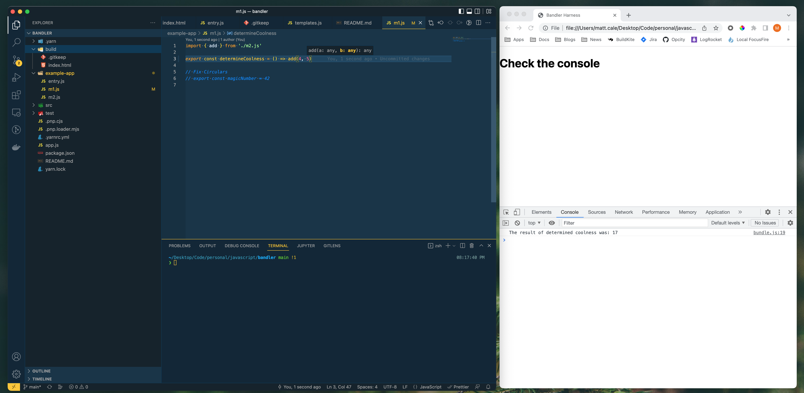
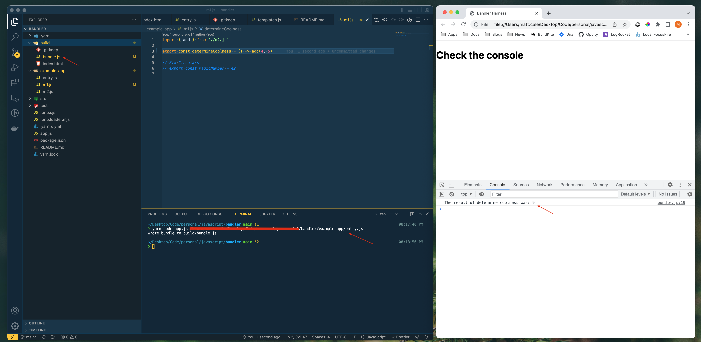

# Bandler Bundler 🧺

## What is this?

It's a basic bunder! It bundles... but not very well! It is largely based on [this article](https://dev.to/iggredible/bundle-your-javascript-code-from-scratch-3dpo), but I've made some notable improvements... At least I think so

## How do I use it?

- You clone it -- `git clone <this-repo>`
- You install dependeicnies -- (I'm using Yarn PnP cause it's rad, but you can likely just `npm i` it)
- You run it -- `yarn node app.js <entry-path>`
  - Full path to entry is required at the moment and circular dependencies make it perish so be careful
- Find your bundle inside of _build_ called _bundle.js_

## Demo

